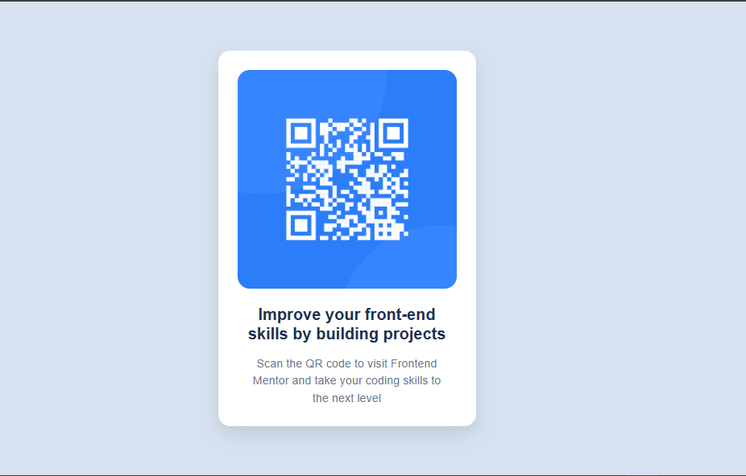

# Frontend Mentor - QR code component solution

This is a solution to the [QR code component challenge on Frontend Mentor](https://www.frontendmentor.io/challenges/qr-code-component-iux_sIO_H). Frontend Mentor challenges help you improve your coding skills by building realistic projects. 

## Table of contents

- [Overview](#overview)
  - [Screenshot](#screenshot)
  - [Links](#links)
- [My process](#my-process)
  - [Built with](#built-with)
  - [What I learned](#what-i-learned)
  - [Useful resources](#useful-resources)
- [Author](#author)

## Overview
This is a solution to the QR Code Component challenge on Frontend Mentor. The goal was to build a simple and responsive QR code card using HTML and CSS. It helped me practice working with layout techniques like Flexbox and improve my understanding of spacing, typography, and responsiveness in a small project.

### Screenshot

### Links

- Solution URL: [GitHub Repository](https://github.com/Lit-97/qrcodefrontendmentor)
- Live Site URL: [Live Site](https://lit-97.github.io/qrcodefrontendmentor/)

## My process
I started by setting up the basic HTML structure with a `main` container, an `img` for the QR code, and text elements using `h1` and `p`. After that, I styled the layout using CSS Flexbox to center everything in the middle of the screen.

I added padding, a box shadow, and border-radius to create a card-like appearance. Then, I adjusted the font styles using a Google Font (Outfit) and used `rem` units for scalable sizing. I finished by adding responsiveness for smaller screens using a simple media query.

### Built with

- Semantic HTML5
- CSS Flexbox
- Mobile-first design
- `rem` units for responsive sizing
- Google Fonts (Outfit)
- Vanilla CSS (no frameworks)

### What I learned

- How to structure a simple HTML layout using semantic tags like `<main>`, `<h1>`, and `
`.
- How to center content vertically and horizontally using Flexbox.
- The difference between `px` and `rem`, and why `rem` is better for scalable designs.
- How to import and apply a Google Font (Outfit) in a project.
- How `max-width` helps keep layouts looking clean on larger screens.
- The importance of resetting default browser styles with `margin: 0` on `body`.

### Useful resources

- [MDN Web Docs](https://developer.mozilla.org/) - My go-to reference for HTML and CSS. I used it to better understand Flexbox, CSS units like `rem`, and general styling practices.
- [MDN Flexbox Guide](https://developer.mozilla.org/en-US/docs/Web/CSS/CSS_Flexible_Box_Layout/Basic_Concepts_of_Flexbox) - Helped me understand how Flexbox works and how to center elements using it.

## Author

- Website - [My Portfolio](https://lit-97.github.io/portfolio/)
- Frontend Mentor - [@Lit-97](https://www.frontendmentor.io/profile/Lit-97)
- GitHub  - [@Lit-97](https://github.com/Lit-97)
